## Hello!


# Tidy R

##

El "tidyverse" es un universo de paquetes de R que siguen una gramática concreta.

Base R

```{r, eval=F}
subset <- data[ , "column1"]
```

Tidyverse

```{r, eval=F}
subset <- select(data, column1)

subset <- data %>% 
  select(column1)
```

# Manos a la obra

## Modelar para explorar

Vamos a utilizar dos técnicas para explorar un dataset de manera un poco distinta:

- Programación funcional
- Modelización para explorar datos

##

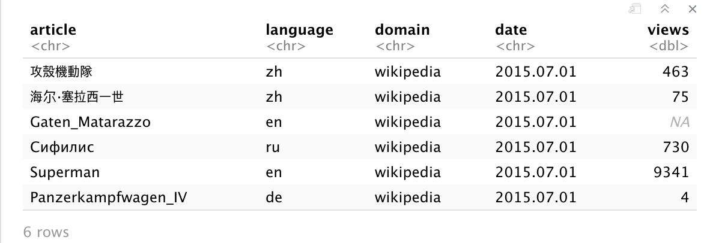

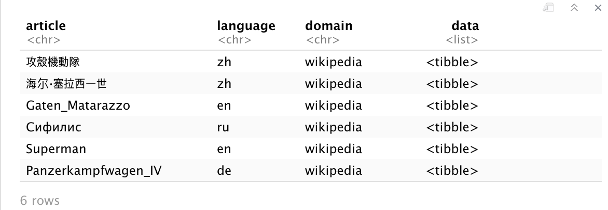

# Importar y leer

## Leer

```{r eval=F}
library(tidyverse)
library(broom)

set.seed(42)
# Training data
data <- read_csv(file = "https://tinyurl.com/wtmzgz") %>% 
  sample_frac(1)

head(data)
```

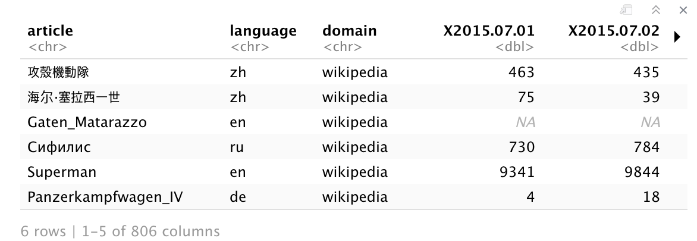

## Pivotar

```{r eval=F}
data <- data %>%
  gather(key = ..., value = ..., -article, -language, -domain)
```

##

```{r eval=F}
data <- data %>%
  gather(key = "date", value = "views", -article, -language, -domain)
```

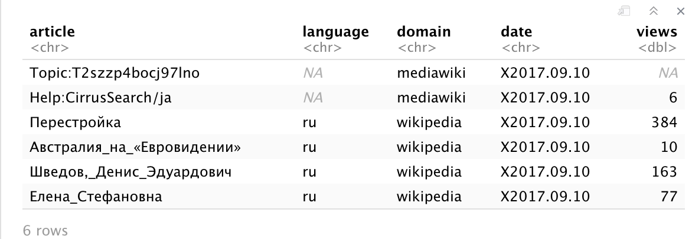

# Consolidar datos

##

```{r eval=F}
str(data)

data <- data %>%
  mutate(date = str_replace(pattern = ..., replacement = ..., date))
```

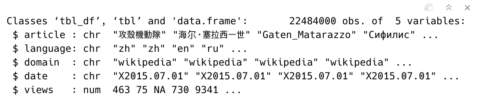

## NESTING!

```{r eval=F}
nested <-  data %>%
  group_by(...) %>% 
  nest()
```

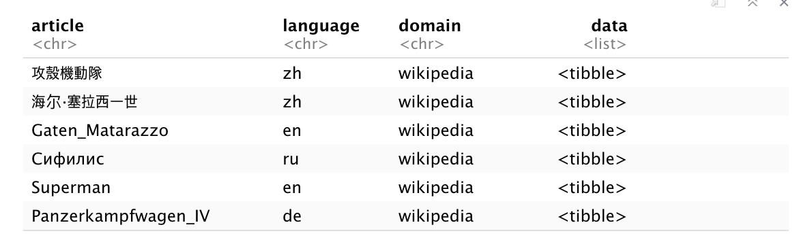

##

```{r eval=F}
nested %>% 
  head(1) %>% 
  select(...) %>% 
  .$data
```

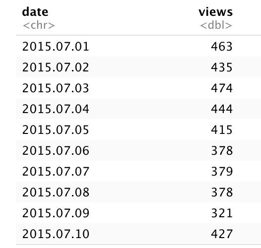

##

```{r eval=F}
nested <- nested %>%
      mutate(data = map(.f = CAST YOUR DATES)
                        , .x = data))
```

##

```{r eval=F}
nested <- nested %>%
      mutate(data = map(.f = ~mutate(., date = as.POSIXct(date, 
                                                       format = "%Y.%m.%d"))
                        , .x = data))
```


# Comparar idiomas

##

```{r eval=F}
nested %>%
  group_by(...) %>% 
  summarise(n = n()) %>%
  mutate(freq = n / sum(n) * 100) %>% 
  filter(freq > 1) %>% 
  drop_na() %>% 
  ggplot(aes(x = ..., y = sort(...), fill = language)) +
  geom_col() +
  ylab("Proportion of pages with language") + 
  theme(legend.position = "")
```

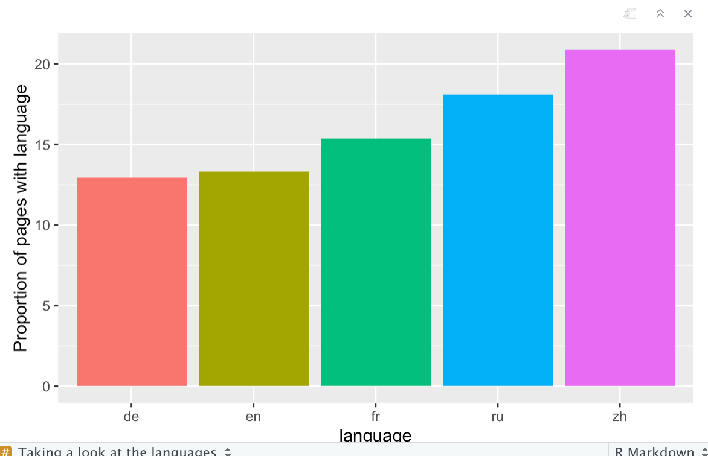

##

```{r eval=F}
nested <- nested %>%
  ungroup() %>% 
  mutate(language = ifelse(
    language %in% ..., language, "other"))
```

## 

```{r eval=F}
nested <- nested %>%
  ungroup() %>% 
  mutate(language = ifelse(
    language %in% c("de", "en", "fr", "ru", "zh", NA), language, "other"))
```


##

```{r eval=F}
# isolate the first page
first_page <- head(nested, 1)

# plot the series of the first page
first_page %>%
      .$data %>%
      .[[1]] %>%
      ggplot(aes(x = ..., y = ..., color = views)) + 
            geom_point() + 
            geom_line() + 
            scale_y_log10()
```

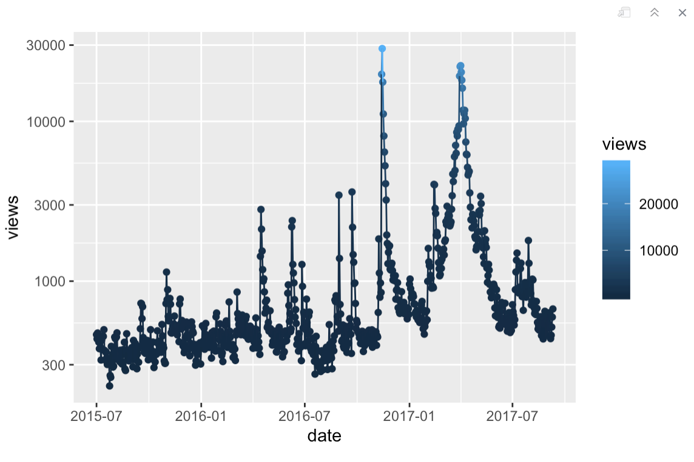

##

```{r eval=F}
# apply an arbitrary metrix on the `views` column of of the nested data
extract_metric <- function(d, metric, ...){
      metric(d$views, ...)
}

# map this H.O.F to get the average, median and standard deviation of views
nested <-  nested %>% 
  mutate(average.views = map_dbl(.f = extract_metric, 
                                 .x = data, metric = mean, na.rm = TRUE), 
         median.views = map_dbl(.f = extract_metric, .x = data, 
                                metric = median, na.rm = TRUE), 
         stddev.views = map_dbl(.f = extract_metric, .x = data, 
                                metric = function(l) sqrt(var(l, na.rm = TRUE))))
```

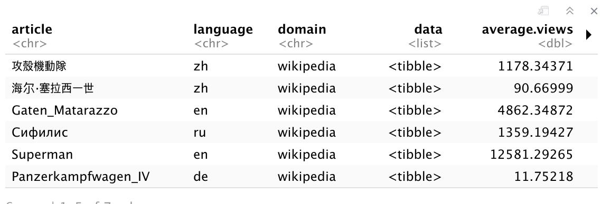

##

```{r eval=F}
nested %>%
      ggplot(aes(x = ..., fill = language)) + 
      geom_density(position = "stack") + 
      scale_x_log10() +
      xlab("Average daily views (log scale)")
```

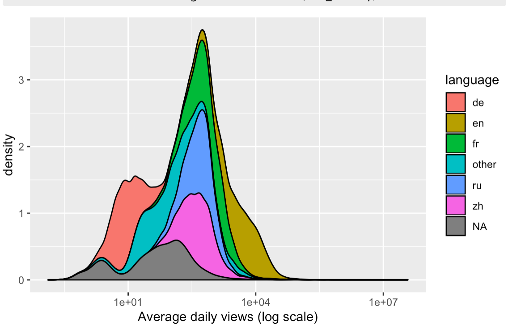

##

```{r eval=F}
nested %>%
      arrange(desc(...))
```

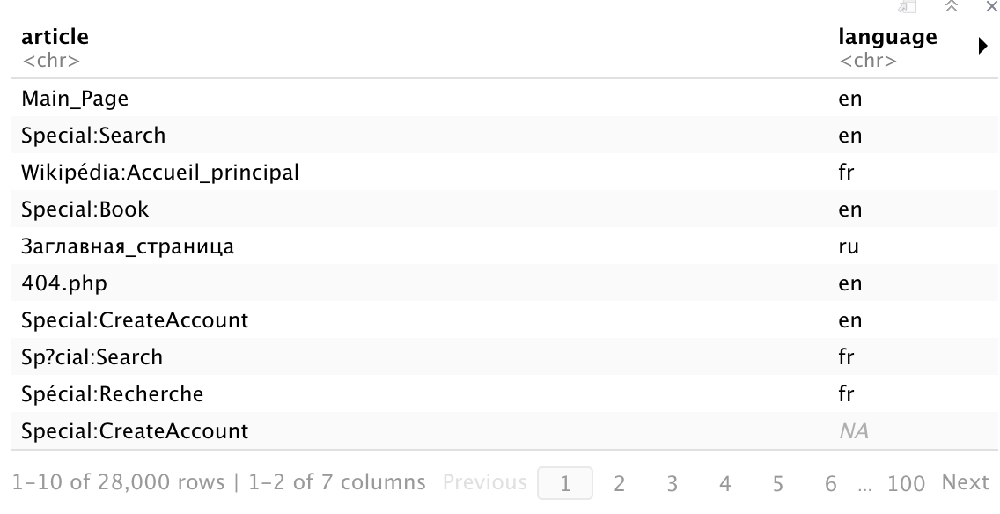

# Ver tendencias

##

```{r eval=F}
# a function for fitting SLR to an inptut dataframe
apply_lm <- function(df){
      lm(data = df, views ~ date)
}

# fit a linear model to each page
nested <-  nested %>%
      mutate(linear_trend = map(.f = ..., .x = ...))

nested %>%
  head() %>%
  select(article, data, linear_trend)
```

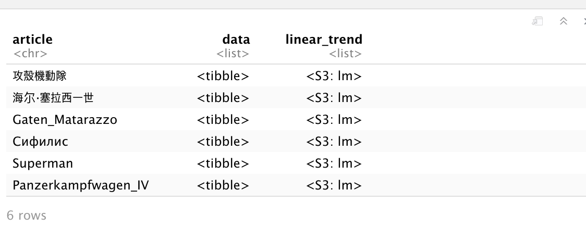

##

```{r eval=F}
# a function for extracting only the R-squared statistics
extract_r2 <- function(model){
  glance(model)$r.squared
}

# map this function onto each model to store the R^2
nested <- nested %>%
  mutate(lm.r.squared = purrr::map_dbl(.f = ..., .x = ...))

nested %>%
  ggplot(aes(x = lm.r.squared)) + 
  geom_density()
```

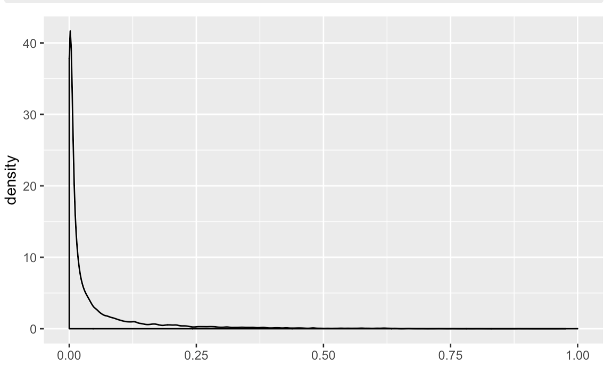

## 

```{r eval=F}
nested %>%
      arrange(desc(lm.r.squared)) %>%
      filter(dplyr::between(row_number(), 10, 15)) %>%
      mutate(chart = purrr::map2(.f = plot_linear_trend, 
                                 .x = data, .y = article)) %>%
      .$chart
```

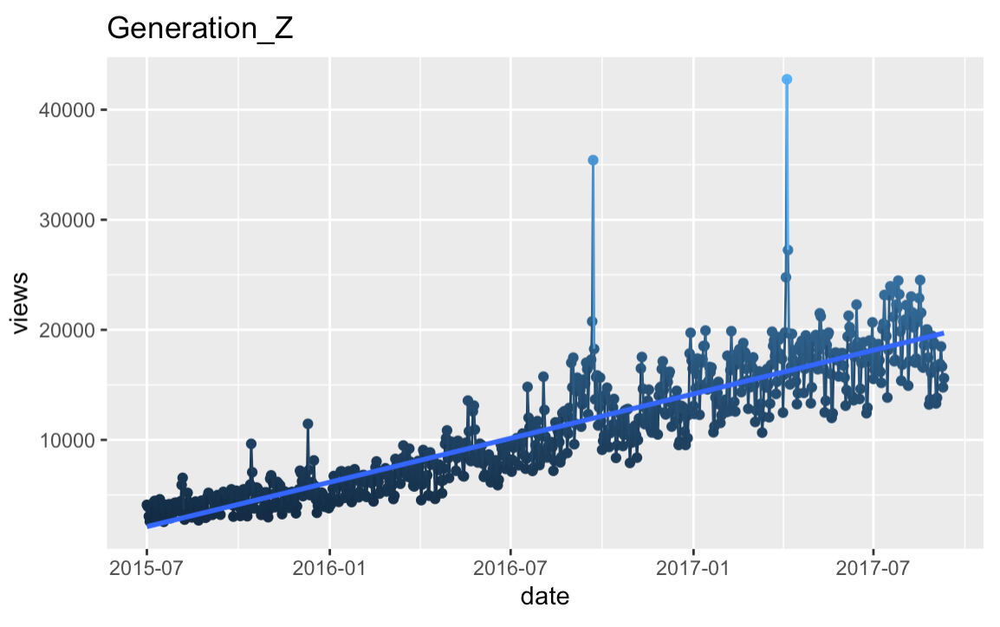